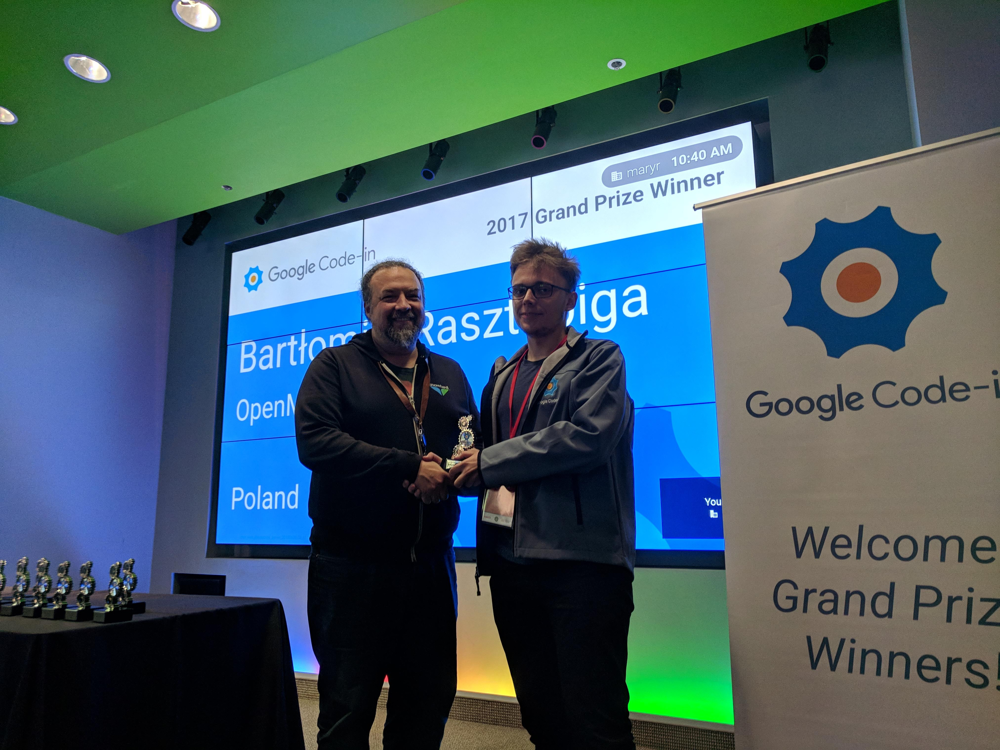

### How did I find about Google Code-in?
I have to thank my friends: Dawid Wąsala and Tomasz Domagała for motivating one another to take part, as it was the last year we could participate. They also gave us a reason to start, we wanted to get these nice Google T-shirts ;)

### Choosing organisation
It was a tough task to choose one of 25 organisations. I was aiming for the one which codes in Java because it is my main programming language. After filtering, I was left with two organisations, JBoss and OpenMRS. The second one interested me more, because of the purpose of their software, "to save lives". That's why I ended in OpenMRS (and I don't regret that).

### First tasks
I have to admit, that until now time I haven't participated in any other open source projects besides my own. That's why it was something new to me, but I was kind of experienced in using things like Jira or Github.

First tasks were pretty easy, only changing a few lines. Their purpose was to introduce us to new, big project (which I still haven't discovered fully)

### Tasks I've done
I will just list them without more description to give you the idea what you can encounter (maybe I will include this in another post, but I don't want to litter this one).

* React UI Library - Input Component
* Add google analytics to Add-Ons
* Add new Provider Attribute Type
* Graphs do not display in the patient Graphs section
* Review pull requests
* React UI Library - Create Button Component
* React UI Library - Create Dropdown Component
* React UI Library - Create Date Picker Component
* Adding a "diagnosis" REST resource
* Should not rely on default encoding
* Comparators should be "Serializable"
* Add a private constructor to utility classes
* Replace the synchronized class by an unsynchronized in ModuleFilterConfig
* Local variable and method parameter names should comply with a naming convention
* Remove duplication in LocationService.getDefaultLocation
* NullPointerException when voiding Observation
* PersonName.getFullName() should use the configured nameLayout
* Possible null pointer dereference due to return value of devDir.listFiles() in ModuleClassLoader
* The multipleInputDate field fragment doesn't display the label passed to it
* Possible null pointer dereference due to return value of folder.listFiles() in OpenmrsUtil
* Serializable FormResource should have a version id
* Complete OpenMRS developer setup on Windows OS, and report outcome
* Synchronization on Boolean in HL7InQueueProcessor
* Possible null pointer dereference due to return value of modulesFolder.listFiles() in ModuleFactory
* Possible null pointer dereference due to return value of file.listFiles() in Listener
* Include requirements for OpenMRS Android Client
* Move refactoring
* Check bad code practices through Findbugs or Sonar and fix those issues.
* Add relevant tags to modules in OpenMRS AddOns
* StartupFilter should not throw generic exceptions
* ModuleServlet Logger should be "private static final"
* Move refactoring
* Attempt this task first

As you can see, I've done 33 tasks, but many of them weren't really difficult at all.

### The outcome of Google Code-in

I've learned many things, e.g. how programming looks like in big, old projects, and also how does communication in such big open source team look like.
That inspired me to create own open source project with my friends, that I will be posting about in the near future. (IoT platform, smart-home included, unfortunately without blockchain xD).

### P.S. Google Code-in 2017 Winner

Yes, a few weeks ago I got an email from Google that I was chosen as GCI Winner together with Fawwaz Yusran (check out his blog, he's a pretty nice guy: <https://f4ww4z.me>). I haven't ever thought about such results so I'm double happy.

Here I want to give thanks to Daniel Kayiwa (<https://github.com/dkayiwa>) for his great support with OpenMRS and Ivange Larry (<https://github.com/ivange94>) for managing GCI tasks (tough job).

